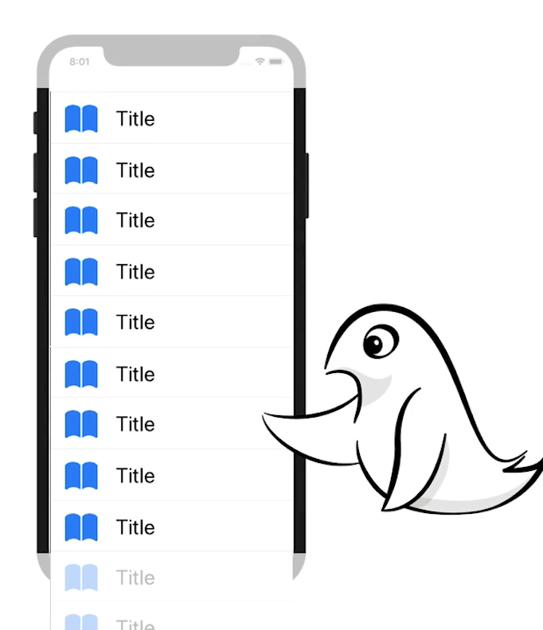
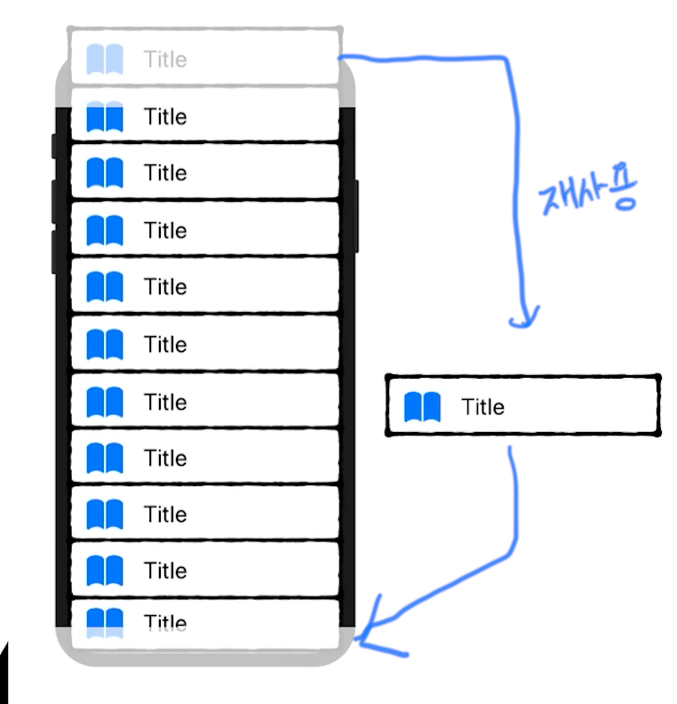

### [Table Views](https://www.raywenderlich.com/10796666-table-views)

[ReadMe App](ReadMe/)

### DataSource

데이터의 중간 관리자로 Table View가 필요한 행, 섹션의 갯수, 셀의 사본 등을 관리한다
UITableViewDataSource 프로토콜을 채택하여 필수적으로 2가지 함수 numberOfRowsInSection, cellForRowAt 을 구현해야 한다

50개의 데이터가 존재한다고 가정해보자
Table View는 DataSource에 50개의 셀을 설정하도록 요청하고 스크롤하게되면 각 항목에 대한 셀을 요청할 떄마다 새로운 셀을 만들어 사용하게 되면 잠재적으로 엄청나게 많은 수의 셀을 만들고 화면에서 셀이 사라질때마다 삭제하는 등 앱의 성능에 영향을 끼칠 수 있다

따라서 사용자에게 보여지는 만큼만 셀을 생성하고 스크롤하게되면 사용자에게 보이지 않는 셀을 빼서 보여질 셀로 변경하게 된다
먼저 생성된 셀이 먼저 화면에서 사라진다(큐)

```swift
override func tableView(_ tableView: UITableView, cellForRowAt indexPath: IndexPath) -> UITableViewCell {
        let cell = tableView.dequeueReusableCell(withIdentifier: "Cell")
        return cell
}
```


<p float="left">
  
  
</p>


